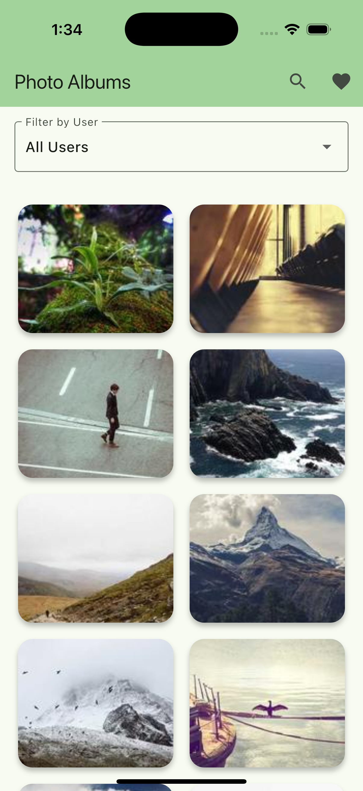

# Photo Albums App

A beautiful Flutter photo album application that allows users to browse albums, search photos, filter by users, and view images in full-screen mode with smooth navigation.

## ✨ Features

- 📸 **Album Management**: Browse photo albums with beautiful card layouts
- 🔍 **Smart Search**: Search through albums and photos instantly
- 👤 **User Filtering**: Filter albums by specific users with dropdown selection
- 🖼️ **Full-Screen Viewer**: Immersive photo viewing experience with zoom and pan
- ❤️ **Favorites**: Mark and save your favorite photos
- 📱 **Responsive Design**: Optimized for all screen sizes
- ⚡ **Performance**: Fast loading with image caching and state management
- 🎨 **Modern UI**: Clean, intuitive interface with smooth animations

## 📱 Screenshots

| Albums Overview | Photo Grid | Full-Screen View |
|-----------------|------------|------------------|
|  |  |  |

*Browse albums with user filtering* | *Grid view of album photos* | *Full-screen photo viewing*

| Albums Video    | 
|-----------------|
| <video src="screenshots/app_video.mov" controls width="300"> Video</video> |

## 🚀 Getting Started

### Prerequisites

- Flutter SDK (3.0.0 or higher)
- Dart SDK (2.17.0 or higher)
- Android Studio / VS Code with Flutter extensions
- Android device/emulator or iOS simulator

### Installation

1. **Clone the repository**
   ```bash
   git clone https://github.com/mhkaycey/photo-albums-app.git
   cd photo-albums-app
   ```

2. **Install dependencies**
   ```bash
   flutter pub get
   ```

3. **Run the app**
   ```bash
   flutter run
   ```

## 🏗️ Project Structure

Based on your Flutter project structure:

```
lib/
├── main.dart                           # App entry point
├── model/                              # Data models
│   ├── album.dart                      # Album model
│   ├── photo.dart                      # Photo model
│   └── user.dart                       # User model
├── providers/                          # Riverpod state management
│   ├── album_provider.dart             # Album state provider
│   └── photos_provider.dart            # Photos state provider
├── screens/                            # App screens
│   ├── albums_photos_screen.dart       # Photo grid view
│   ├── albums_screen.dart              # Albums overview
│   ├── favorites_screen.dart           # Favorites screen
│   ├── photo_viewer_screen.dart        # Full-screen photo viewer
│   └── search_screen.dart              # Search functionality
└── services/                           # API and data services
    ├── api_service.dart                # HTTP API calls
    └── favourite_service.dart          # Favorites management
```

## 📦 Dependencies

```yaml
dependencies:
  flutter:
    sdk: flutter
  cupertino_icons: ^1.0.8              # iOS-style icons
  http: ^1.5.0                         # HTTP requests
  shared_preferences: ^2.5.3           # Local storage
  cached_network_image: ^3.4.1         # Image caching
  photo_view: ^0.15.0                  # Photo zoom/pan viewer
  flutter_riverpod: ^2.6.1             # State management

dev_dependencies:
  flutter_test:
    sdk: flutter
  flutter_lints: ^4.0.0
```

## 💡 Key Features Explained

### Album Browsing
- Clean card-based layout showing album titles and user information
- Filter albums by specific users using the dropdown menu
- Tap any album card to view its photos

### Photo Grid View
- Grid layout displaying all photos in the selected album
- Optimized image loading with caching for smooth scrolling
- Photo count indicator in the header

### Full-Screen Photo Viewer
- Immersive viewing experience with zoom and pan capabilities
- Navigation between photos with swipe gestures
- Photo counter (e.g., "2 of 50") for easy tracking
- Heart icon for favoriting photos

### Search Functionality
- Real-time search across albums and photos
- Search results update as you type
- Quick access via search icon in the app bar

### State Management
- Efficient state management using Riverpod
- Cached image loading for better performance
- Persistent favorites using SharedPreferences

## 🔧 Configuration

### API Integration
Update the API endpoint in `lib/services/api_service.dart`:

```dart
class ApiService {
  static const String baseUrl = 'https://your-api-endpoint.com';
  
}
```

### Customization
- Modify colors and themes in your main.dart
- Adjust grid layout in `albums_photos_screen.dart`
- Customize photo viewer behavior in `photo_viewer_screen.dart`

## 🤝 Contributing

Contributions are welcome! Please feel free to submit a Pull Request.

1. Fork the Project
2. Create your Feature Branch (`git checkout -b feature/AmazingFeature`)
3. Commit your Changes (`git commit -m 'Add some AmazingFeature'`)
4. Push to the Branch (`git push origin feature/AmazingFeature`)
5. Open a Pull Request

## 🐛 Known Issues

- Image loading may be slow on poor network connections
- Large albums might take time to load all thumbnails

## 🔮 Future Enhancements

- [ ] Offline photo caching
- [ ] Photo sharing functionality
- [ ] Album creation and editing
- [ ] Advanced search filters
<!-- - [ ] Dark mode support
- [ ] Photo metadata display -->

## 📄 License

This project is licensed under the MIT License - see the [LICENSE](LICENSE) file for details.

## 👨‍💻 Author

Your Name - [@mhkaycey](https://github.com/mhkaycey)

<!-- Project Link: [https://github.com/yourusername/photo-albums-app](https://github.com/yourusername/photo-albums-app) -->

---

Made with ❤️ using Flutter & Dart